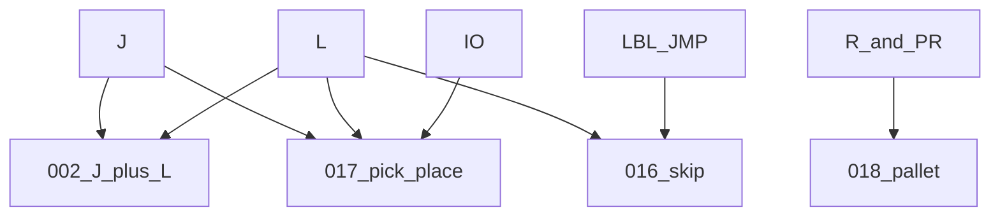

# Topic map — atoms and unions

> Status: reviewed  
> Brand: FANUC  
> Mode: learner, programmer  
> Track: 01 HandlingTool

Study **one instruction family** first (atom), then a **combined program** (union). HandlingTool has **JMP LBL**, not BASIC `GOTO`.

Lexicon (not atoms): [identifiers](programming-tp/identifiers.md) (names and indices) and [keywords](programming-tp/keywords.md) (reserved words).

## Atoms

| Atom | Article | Drill |
|------|---------|-------|
| Joint (J) | [motion-j.md](programming-tp/motion-j.md) | [011](../../practice/fanuc/011-joint-only/) |
| Linear (L) | [motion-l.md](programming-tp/motion-l.md) | [012](../../practice/fanuc/012-linear-only/) |
| Circular (C) | [motion-types-fine-cnt.md](programming-tp/motion-types-fine-cnt.md) | [003](../../practice/fanuc/003-circular-path/) |
| LBL / JMP / IF | [logic-lbl-jmp.md](programming-tp/logic-lbl-jmp.md) | [013](../../practice/fanuc/013-lbl-jmp/) |
| SKIP CONDITION | [logic-skip.md](programming-tp/logic-skip.md) | [016](../../practice/fanuc/016-skip-linear/) |
| Remark | [remark.md](programming-tp/remark.md) | [014](../../practice/fanuc/014-remark-header/) |
| UALM | [ualm.md](programming-tp/ualm.md) | [020](../../practice/fanuc/020-user-alarm/) |
| MESSAGE | [message.md](programming-tp/message.md) | [021](../../practice/fanuc/021-message/) |
| Override | [override.md](programming-tp/override.md) | [015](../../practice/fanuc/015-override-instr/) |
| R[] numeric | [registers-numeric.md](programming-tp/registers-numeric.md) | [006](../../practice/fanuc/006-loop-call/) |
| P[] vs PR[] vs displacement | [pr-vs-r.md](io-frames-tools/pr-vs-r.md) | [004](../../practice/fanuc/004-incremental-box/), [005](../../practice/fanuc/005-offset-path/), [008](../../practice/fanuc/008-pr-lpos/) |
| DI/DO RI/RO GI/GO SOP UOP SI/SO | [io-classes.md](io-frames-tools/io-classes.md), [io-sop-uop.md](io-frames-tools/io-sop-uop.md), [io-safety-si-so.md](io-frames-tools/io-safety-si-so.md) | [007](../../practice/fanuc/007-wait-gripper/) |
| CALL | [registers-jumps-call.md](programming-tp/registers-jumps-call.md) | [010](../../practice/fanuc/010-main-call/) |

## Unions

| Union | What it combines | Article | Drill |
|-------|------------------|---------|-------|
| Square path | J + L + FINE | [motion-types-fine-cnt.md](programming-tp/motion-types-fine-cnt.md) | [002](../../practice/fanuc/002-square-path/) |
| Wait + branch | RI/RO + JMP LBL + UALM | [io-classes.md](io-frames-tools/io-classes.md) | [007](../../practice/fanuc/007-wait-gripper/) |
| Skip on Linear | L + SKIP + LBL | [skip-and-contour.md](applications/skip-and-contour.md) | [016](../../practice/fanuc/016-skip-linear/) |
| Pick and place | J + L + I/O + home | [pick-and-place.md](applications/pick-and-place.md) | [017](../../practice/fanuc/017-pick-place/) |
| Pallet grid | R[] matrix + OFFSET/PR | [pallet-grid.md](applications/pallet-grid.md) | [018](../../practice/fanuc/018-pallet-grid/) |
| Contour / plot | several L points + J home | [skip-and-contour.md](applications/skip-and-contour.md) | [019](../../practice/fanuc/019-contour-plot/) |

Order to study: [learning-path.md](learning-path.md). Words: [`../glossary.md`](../glossary.md).

## Official references

On manuals **licensed to your site**: instruction list for your HandlingTool version. Do not paste OEM pages here.

## Rights, education, and consent

FANUC retains **all rights** in its trademarks, software, and manuals. See [`LEGAL.md`](../../LEGAL.md).

This page and any linked programs are **educational and study-aid only**. Use at **your own consent and risk**. Garry TJ / this repo are not FANUC and offer no warranty.
