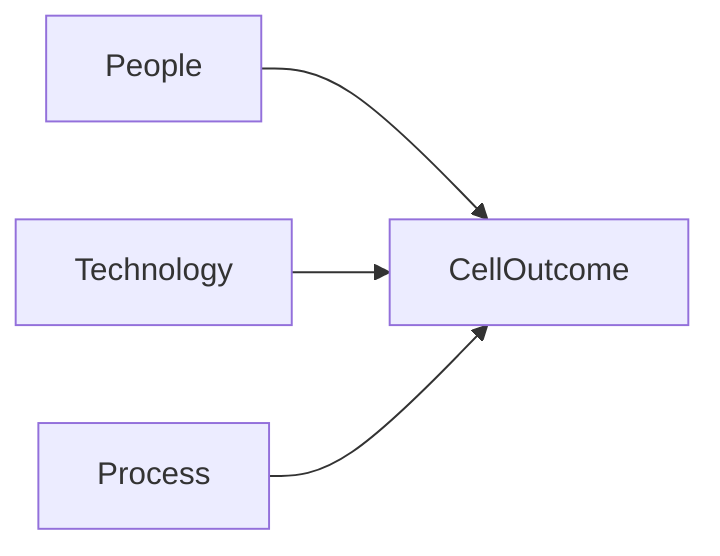

# SMB robotics adoption

> Status: draft  
> Brand: none (industry)  
> Mode: integrator, learner

## Overview

This page covers **why** a plant adopts robots (capital vs operating vs training cost, cultural buy-in). FANUC syntax stays under `docs/fanuc/`.

## When to use

- Building a business case before operator/programmer training
- Talking to operators about automation without TP details

## Definition

**Capital** (robot, install, integration) vs **operating** (energy, spares, licenses) vs **workforce** (operate, program, maintain).

## System

## Worked example

Pair a financial case with a training plan (this study track) so programming skill is not an afterthought.

## Practice

Not a TP drill. Return to [`practice/fanuc/`](../../practice/fanuc/).

## Common mistakes

- Buying hardware with no training budget
- Skipping shop-floor communication on safety and job design

## Safety notes

New robots change LOTO, fencing, and collaborative vs industrial rules.

## Official references

## Repo references

- [`../fanuc/learning-path.md`](../fanuc/learning-path.md)
- [`../sources.md`](../sources.md)

## Rights, education, and consent

FANUC retains **all rights** in its trademarks, software, and manuals. See [`LEGAL.md`](../../LEGAL.md).

This page and any linked programs are **educational and study-aid only**. Use at **your own consent and risk**. Garry TJ / this repo are not FANUC and offer no warranty.
