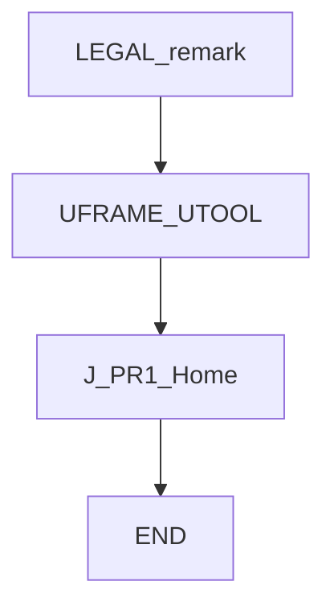
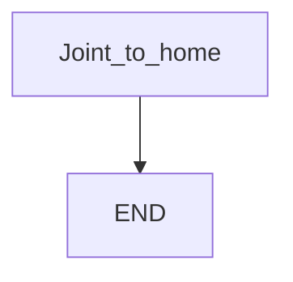

# Home Safe — guide

> Drill: `001-home-safe`  
> Code: [`code/solution.ls`](../code/solution.ls)

## Purpose

Joint to a **taught home** `PR[1]` at low percent, FINE. Optional AtHome DO is remarked out (placeholder). Recovery and production should share this pose.

## Flowchart

## Decisions (diamond)

No IF / WAIT / SKIP. Straight path.

## Block-by-block

| Line | What | Atom |
|------|------|------|
| 0 | LEGAL remark | Remark |
| 1–2 | Sample / ask remarks | Remark |
| 3–4 | Select user and tool frame (placeholders) | Frame |
| 5 | Note: teach PR[1] on the cell | Remark |
| 6 | Joint to home, 20%, FINE | J |
| 7–8 | Optional DO commented — not executed | Remark |
| 9 | END | END |

## Safety

Prove in T1. Home must be free space. Site SOP and OEM manuals override this page.

## Rights

See [`LEGAL.md`](../../../../LEGAL.md): FANUC retains all rights. Educational use; own consent and risk.
