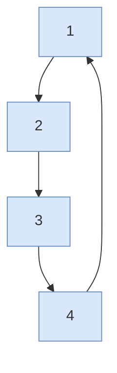

# Square path — guide

> Drill: `002-square-path`  
> Code: [`code/solution.ls`](../code/solution.ls)

## Purpose

In plain English: fly to the work in **Joint**, then draw a **square** in a straight line, then Joint home. Teach every corner on **your** arm.

On the pendant: **J** approach, **L** sides at **FINE**, **J** return. This is the first **union** (J + L), not an atom.

## Path / origin

Study sketch in **UFRAME**. Not millimetres. Teach on the cell.

**J** fly in, **L** around **1-2-3-4** FINE, **J** home.



## Program flow

```mermaid
flowchart TB
  start(["start"])
  rem("L0-1 remarks")
  fr["L2-3 UFRAME UTOOL"]
  j1["L4-5 J approach"]
  sq["L6-9 L square FINE"]
  jh["L10 J return P1"]
  endn(["L11 END"])
  start -.-> rem
  rem --> fr
  fr ==> j1
  j1 ==> sq
  sq ==> jh
  jh ==> endn
  classDef proc fill:#DAE8FC,stroke:#6C8EBF
  classDef dec fill:#FFF2CC,stroke:#D6B656
  classDef io fill:#D5E8D4,stroke:#82B366
  classDef call fill:#E1D5E7,stroke:#9673A6
  classDef fault fill:#F8CECC,stroke:#B85450
  classDef term fill:#F5F5F5,stroke:#666666
  classDef note fill:#FFFFFF,stroke:#999999,stroke-dasharray: 5 5
  class start,endn term
  class rem note
  class fr,j1,sq,jh proc
```

## Listing (`/MN`)

`L#` on the chart is the number before `:` here. Full file: [`code/solution.ls`](../code/solution.ls).

```
   0:  ! FANUC retains all rights in its marks/software/manuals. Educational only. Use at your own consent and risk. See LEGAL.md ;
   1:  ! Study drill. Teach all P[] / PR[] on the cell.
   2:  UFRAME_NUM=1 ;
   3:  UTOOL_NUM=1 ;
   4:  J P[1] 100% FINE    ;
   5:  J P[2] 100% FINE    ;
   6:  L P[3] 500mm/sec FINE    ;
   7:  L P[4] 500mm/sec FINE    ;
   8:  L P[5] 500mm/sec FINE    ;
   9:  L P[2] 500mm/sec FINE    ;
   10:  J P[1] 100% FINE    ;
   11:  END ;
```

## Block-by-block

How to read this chart: [`how-to-read-a-guide.md`](../../../../docs/fanuc/how-to-read-a-guide.md). Atoms (J, L, WAIT, …): [`glossary.md`](../../../../docs/glossary.md).

| Lines | What | Atom |
|-------|------|------|
| 0–1 | LEGAL + study remarks | [Remark](../../../../docs/fanuc/programming-tp/remark.md) |
| 2–3 | Frame select | [Frame](../../../../docs/fanuc/io-frames-tools/frames.md) |
| 4–5 | Joint approach | [J](../../../../docs/fanuc/programming-tp/motion-j.md) |
| 6–9 | Linear square FINE | [L](../../../../docs/fanuc/programming-tp/motion-l.md) |
| 10 | Joint return | [J](../../../../docs/fanuc/programming-tp/motion-j.md) |
| 11 | END | [END](../../../../docs/glossary.md) |

## Safety

Prove in T1, then T2 step, then Auto. Placeholders only. Site SOP and OEM manuals override this page.

## Rights

See [`LEGAL.md`](../../../../LEGAL.md): FANUC retains all rights. Educational use; own consent and risk.
