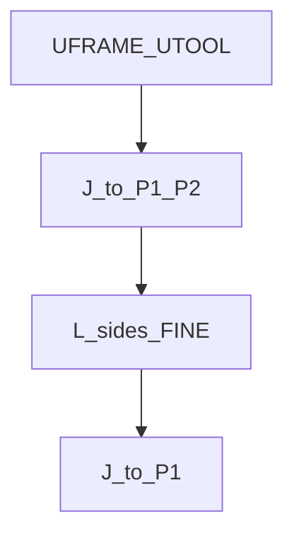
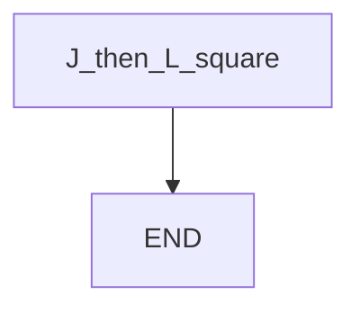

# Square path — guide

> Drill: `002-square-path`  
> Code: [`code/solution.ls`](../code/solution.ls)

## Purpose

**Union** of Joint and Linear: fly to the square in **J**, trace four sides in **L** at FINE, Joint back. Teach P[1]–P[5] on the cell. Placeholders only.

## Flowchart

## Decisions (diamond)

No IF / WAIT / SKIP / UALM. Straight sequence.

## Block-by-block

| Lines | What | Atom |
|-------|------|------|
| 0–1 | LEGAL + study remarks | Remark |
| 2–3 | User/tool frame numbers (placeholders) | Frame |
| 4–5 | Joint approach | J |
| 6–9 | Linear square, FINE | L |
| 10 | Joint return | J |
| 11 | END | END |

## Safety

Prove in T1, then T2 step, then Auto. Site SOP and OEM manuals override this page.

## Rights

See [`LEGAL.md`](../../../../LEGAL.md): FANUC retains all rights. Educational use; own consent and risk.
