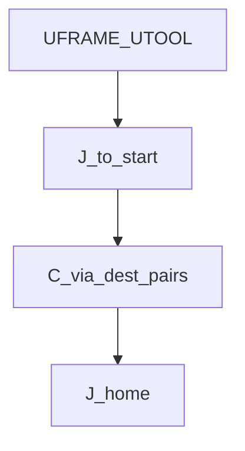
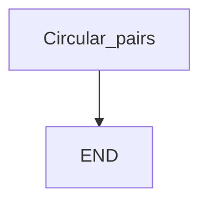

# Circular path — guide

> Drill: `003-circular-path`  
> Code: [`code/solution.ls`](../code/solution.ls)

## Purpose

**C** instructions are **via, dest** pairs: first line is the via `P[]`, second line is the destination with feed and FINE/CNT. Joint to start, several arcs, Joint home. Teach all points on the cell.

## Flowchart

## Decisions (diamond)

No IF / WAIT / SKIP / UALM. Straight sequence.

## Block-by-block

| Lines | What | Atom |
|-------|------|------|
| 0–1 | LEGAL + via/dest remark | Remark |
| 2–3 | Frame select | Frame |
| 4–5 | Joint to path start | J |
| 6–13 | Four `C` via/dest pairs (dest line is still Circular) | C |
| 14 | Joint home | J |
| 15 | END | END |

## Safety

Prove in T1. FINE stops; CNT rounds — do not CNT into a clamp on first teach. Site SOP and OEM manuals override this page.

## Rights

See [`LEGAL.md`](../../../../LEGAL.md): FANUC retains all rights. Educational use; own consent and risk.
