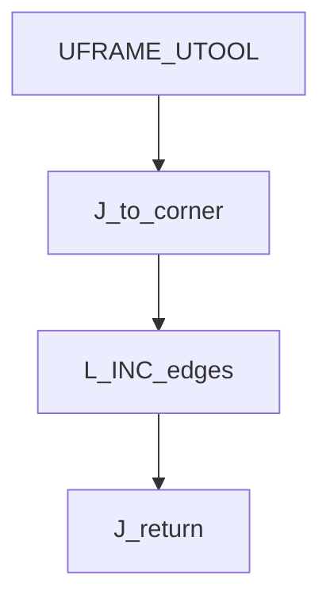
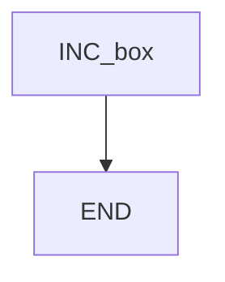

# Incremental box — guide

> Drill: `004-incremental-box`  
> Code: [`code/solution.ls`](../code/solution.ls)

## Purpose

**INC** uses the recorded pose as a **delta**, not a world location. Joint to a corner, Linear INC along box edges, Joint back. After INC, edit the XYZ (or WPR) **increments** on the pendant. Distances in the listing are examples, not cell pitch.

## Flowchart

## Decisions (diamond)

No IF / WAIT / SKIP / UALM. Straight sequence.

## Block-by-block

| Lines | What | Atom |
|-------|------|------|
| 0–1 | LEGAL + edit-increments remark | Remark |
| 2–3 | Frame select | Frame |
| 4–5 | Joint to start corner | J |
| 6–9 | Linear INC sides | L + INC |
| 10 | Joint return | J |
| 11 | END | END |

Do not stack **OFFSET** on these INC lines in this drill.

## Safety

Prove in T1. A wrong increment can drive through the fixture. Site SOP and OEM manuals override this page.

## Rights

See [`LEGAL.md`](../../../../LEGAL.md): FANUC retains all rights. Educational use; own consent and risk.
