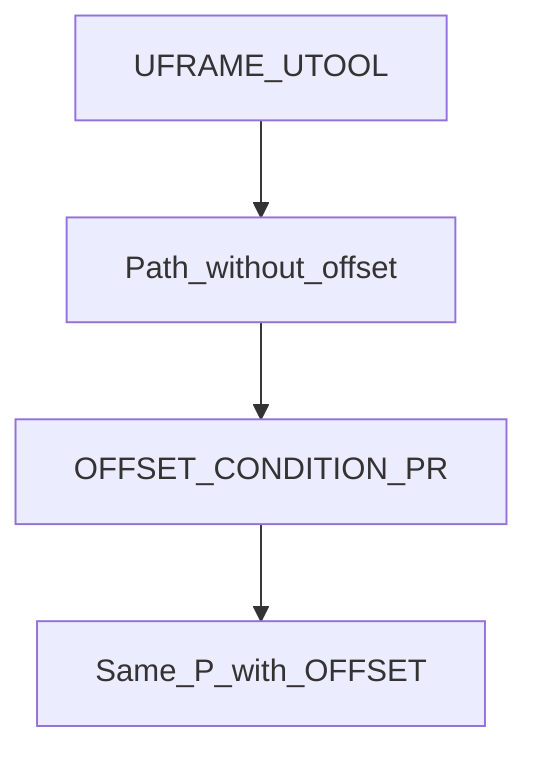
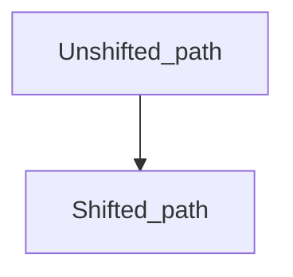

# Offset path — guide

> Drill: `005-offset-path`  
> Code: [`code/solution.ls`](../code/solution.ls)

## Purpose

Run the taught square **once**, then **OFFSET CONDITION** on a displacement **PR** and run the **same P[]** again with **OFFSET**. Teach PR[1] as the shift on the cell. Not valid on INC lines in this drill.

## Flowchart

## Decisions (diamond)

No IF / WAIT / SKIP / UALM. Two passes of the same geometry.

## Block-by-block

| Lines | What | Atom |
|-------|------|------|
| 0–1 | LEGAL + teach-PR remark | Remark |
| 2–3 | Frame select | Frame |
| 4–10 | First square (J + L), no OFFSET | J / L |
| 11 | Arm displacement | OFFSET CONDITION |
| 12–18 | Same points with OFFSET | J / L + OFFSET |
| 19 | END | END |

## Safety

Prove in T1. Wrong UFRAME or PR shift can miss the nest. Site SOP and OEM manuals override this page.

## Rights

See [`LEGAL.md`](../../../../LEGAL.md): FANUC retains all rights. Educational use; own consent and risk.
