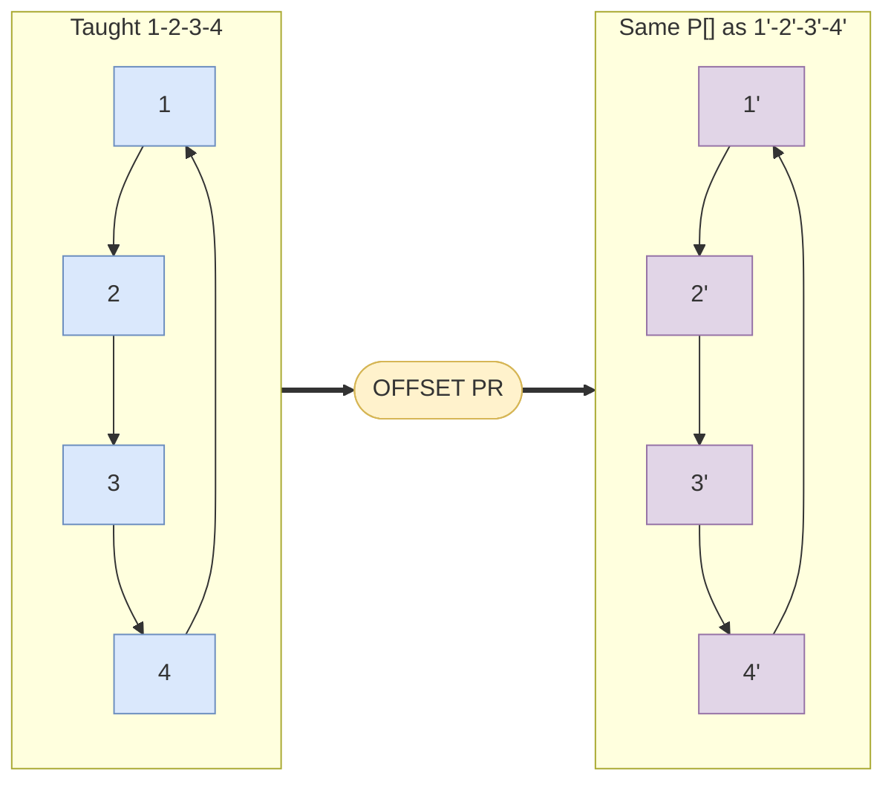

# Offset path — guide

> Drill: `005-offset-path`  
> Code: [`code/solution.ls`](../code/solution.ls)

## Purpose

In plain English: run a taught square once, then run the **same points shifted** by a displacement you taught.

On the pendant: first pass without offset, then **OFFSET CONDITION** on a PR and the same **P[]** with **OFFSET**. Do not mix OFFSET onto **INC** lines.

## Path / origin

Study sketch in **UFRAME**. Not millimetres. Teach on the cell.

First pass taught **1-2-3-4**. Then **OFFSET CONDITION** and the **same P[]** as **1'-2'-3'-4'**.



## Program flow

```mermaid
flowchart TB
  start(["start"])
  rem("L0-1 teach PR1")
  fr["L2-3 UFRAME UTOOL"]
  p1["L4-10 path no offset"]
  arm["L11 OFFSET CONDITION PR1"]
  p2["L12-18 same P with OFFSET"]
  endn(["L19 END"])
  start -.-> rem
  rem --> fr
  fr ==> p1
  p1 ==> arm
  arm ==> p2
  p2 ==> endn
  classDef proc fill:#DAE8FC,stroke:#6C8EBF
  classDef dec fill:#FFF2CC,stroke:#D6B656
  classDef io fill:#D5E8D4,stroke:#82B366
  classDef call fill:#E1D5E7,stroke:#9673A6
  classDef fault fill:#F8CECC,stroke:#B85450
  classDef term fill:#F5F5F5,stroke:#666666
  classDef note fill:#FFFFFF,stroke:#999999,stroke-dasharray: 5 5
  class start,endn term
  class rem note
  class fr,p1,arm,p2 proc
```

## Listing (`/MN`)

`L#` on the chart is the number before `:` here. Full file: [`code/solution.ls`](../code/solution.ls). Step it yourself: the **Run** tab on this drill's page in the study UI (FWD like T2, toggle I/O, watch registers).

```
   0:  ! FANUC retains all rights in its marks/software/manuals. Educational only. Use at your own consent and risk. See LEGAL.md ;
   1:  ! Teach PR[1] as the shift. Not valid on INC lines. ;
   2:  UFRAME_NUM=1 ;
   3:  UTOOL_NUM=1 ;
   4:  J P[1] 100% FINE    ;
   5:  J P[2] 100% FINE    ;
   6:  L P[3] 500mm/sec FINE    ;
   7:  L P[4] 500mm/sec FINE    ;
   8:  L P[5] 500mm/sec FINE    ;
   9:  L P[2] 500mm/sec FINE    ;
   10:  J P[1] 100% FINE    ;
   11:  OFFSET CONDITION PR[1]    ;
   12:  J P[1] 100% FINE Offset    ;
   13:  J P[2] 100% FINE Offset    ;
   14:  L P[3] 500mm/sec FINE Offset    ;
   15:  L P[4] 500mm/sec FINE Offset    ;
   16:  L P[5] 500mm/sec FINE Offset    ;
   17:  L P[2] 500mm/sec FINE Offset    ;
   18:  J P[1] 100% FINE Offset    ;
   19:  END ;
```

## Block-by-block

How to read this chart: [`how-to-read-a-guide.md`](../../../../docs/fanuc/how-to-read-a-guide.md). Atoms (J, L, WAIT, …): [`glossary.md`](../../../../docs/glossary.md).

| Lines | What | Atom |
|-------|------|------|
| 0–1 | LEGAL + teach-PR remark | [Remark](../../../../docs/fanuc/programming-tp/remark.md) |
| 2–3 | Frame select | [Frame](../../../../docs/fanuc/io-frames-tools/frames.md) |
| 4–10 | First square J+L | [J](../../../../docs/fanuc/programming-tp/motion-j.md) / [L](../../../../docs/fanuc/programming-tp/motion-l.md) |
| 11 | Arm displacement | [OFFSET CONDITION](../../../../docs/fanuc/programming-tp/offset-and-incremental.md) |
| 12–18 | Same points with OFFSET | [J](../../../../docs/fanuc/programming-tp/motion-j.md) / [L](../../../../docs/fanuc/programming-tp/motion-l.md) + [OFFSET](../../../../docs/fanuc/programming-tp/offset-and-incremental.md) |
| 19 | END | [END](../../../../docs/glossary.md) |

## Safety

Prove in T1, then T2 step, then Auto. Placeholders only. Site SOP and OEM manuals override this page.

## Rights

See [`LEGAL.md`](../../../../LEGAL.md): FANUC retains all rights. Educational use; own consent and risk.
