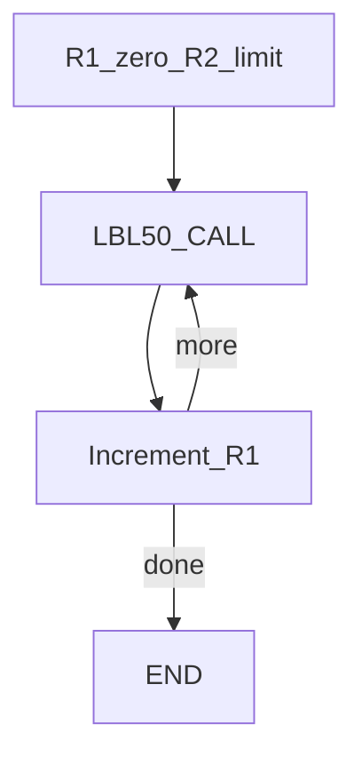
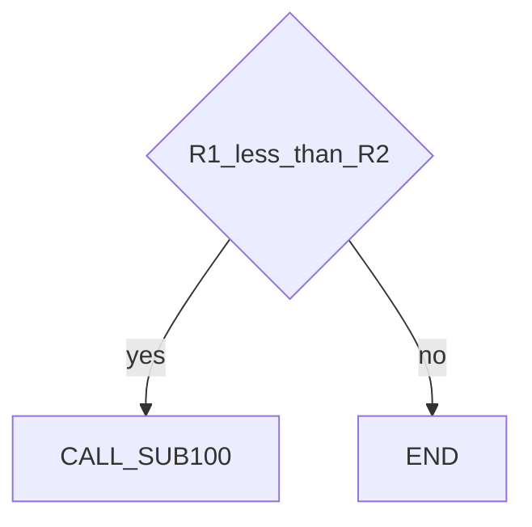

# Register loop and CALL — guide

> Drill: `006-loop-call`  
> Code: [`code/solution.ls`](../code/solution.ls)

## Purpose

Count with **R[]**, **CALL** a sub that must exist on the controller, increment, **IF** jump back. Data only through registers. `SUB100` is a placeholder name.

## Flowchart

## Decisions (diamond)

## Block-by-block

| Lines | What | Atom |
|-------|------|------|
| 0–1 | LEGAL + sub-name remark | Remark |
| 2–3 | Counter and limit | R[] |
| 4–6 | Label, CALL, increment | LBL / CALL / R[] |
| 7 | Loop while `R[1]<R[2]` | IF / JMP |
| 8 | END | END |

## Safety

Prove in T1. Infinite JMP if the IF never fails. Site SOP and OEM manuals override this page.

## Rights

See [`LEGAL.md`](../../../../LEGAL.md): FANUC retains all rights. Educational use; own consent and risk.
