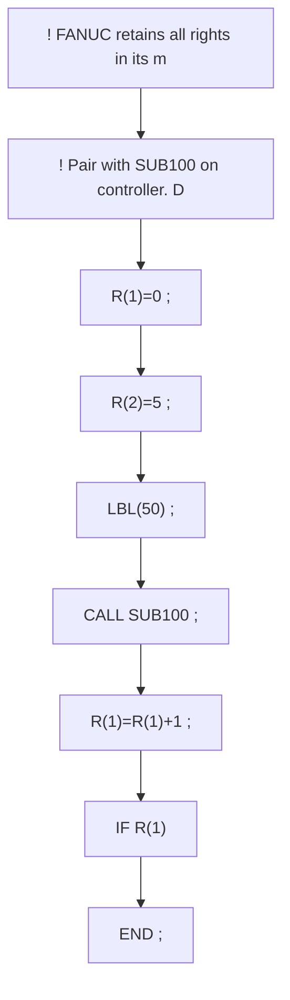
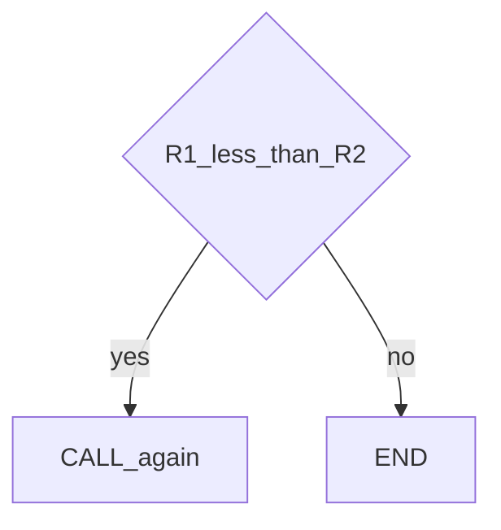

# Loop Call: Register loop and CALL — guide

> Drill: `006-loop-call`  
> Code: [`code/solution.ls`](../code/solution.ls)

## Purpose

Study listing for **Loop Call: Register loop and CALL**. Confirm frames, poses, and I/O on your cell.

## Flowchart

## Decisions (diamond)

## Block-by-block

| Line | What | Atom |
|------|------|------|
| 0 | `! FANUC retains all rights in its marks/software/manuals. Educational only. Use ` | Remark |
| 1 | `! Pair with SUB100 on controller. Data via R[] only.` | Remark |
| 2 | `R[1]=0    ;` | R[] |
| 3 | `R[2]=5    ;` | R[] |
| 4 | `LBL[50] ;` | LBL |
| 5 | `CALL SUB100    ;` | CALL |
| 6 | `R[1]=R[1]+1    ;` | R[] |
| 7 | `IF R[1]<R[2],JMP LBL[50] ;` | JMP/IF |
| 8 | `END ;` | END |

## Safety

Prove in T1, then T2 step, then Auto. Placeholders only. Site SOP and OEM manuals override this page.

## Rights, education, and consent

FANUC retains **all rights** in its trademarks, software, and manuals. See [`LEGAL.md`](../../../../LEGAL.md).

This page and any linked programs are **educational and study-aid only**. Use at **your own consent and risk**. Garry TJ / this repo are not FANUC and offer no warranty.

