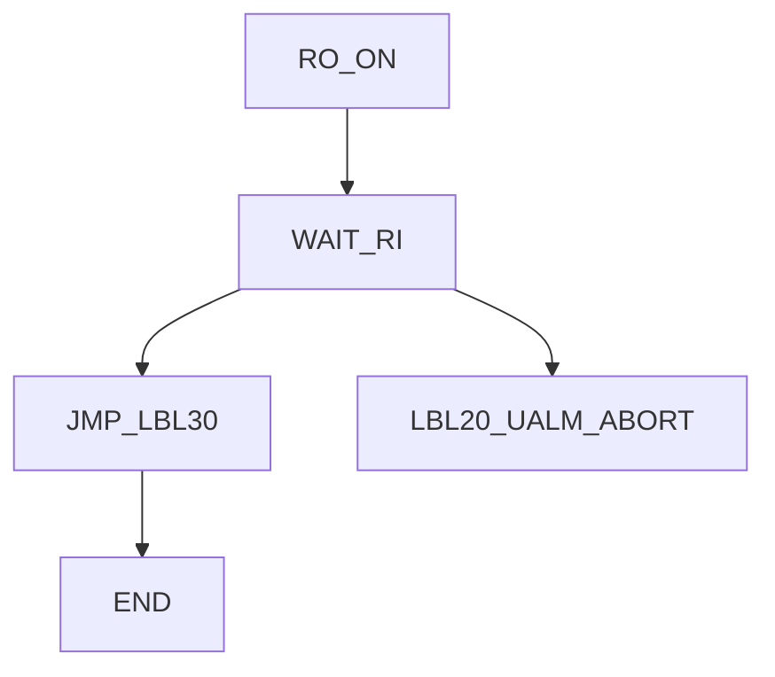
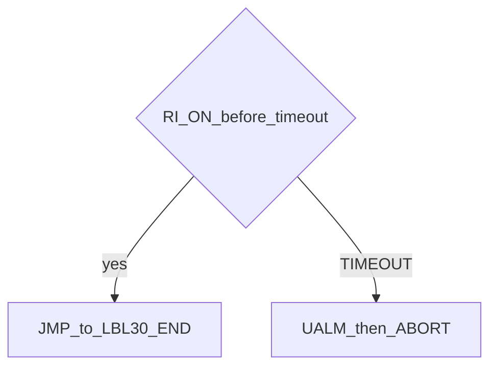

# Wait Gripper — guide

> Drill: `007-wait-gripper`  
> Code: [`code/solution.ls`](../code/solution.ls)

## Purpose

Turn a placeholder **RO** on, **WAIT** for **RI**. On timeout, **UALM** then **ABORT**. On success, skip the fault block with **JMP LBL**.

## Flowchart

## Decisions (diamond)

## Block-by-block

| Line | What | Atom |
|------|------|------|
| 0–1 | LEGAL + placeholder I/O remarks | Remark |
| 2 | Gripper output ON | I/O |
| 3 | WAIT RI; timeout → LBL[20] | WAIT |
| 4 | Success: jump past alarm | JMP |
| 5–7 | Fault: UALM[1], ABORT | UALM |
| 8–9 | Success label and END | LBL |

`UALM[1]` text is configured on the **controller**, not in this listing.

## Safety

Prove in T1. RI/RO are placeholders. Site SOP and OEM manuals override this page.

## Rights, education, and consent

FANUC retains **all rights** in its trademarks, software, and manuals. See [`LEGAL.md`](../../../../LEGAL.md).

This page and any linked programs are **educational and study-aid only**. Use at **your own consent and risk**. Garry TJ / this repo are not FANUC and offer no warranty.
