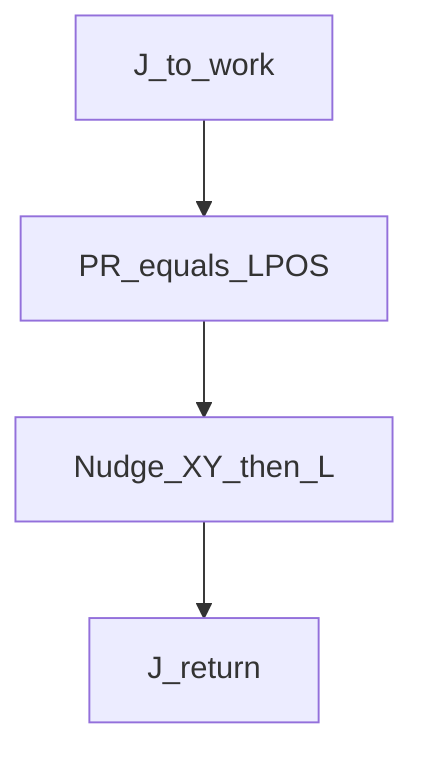
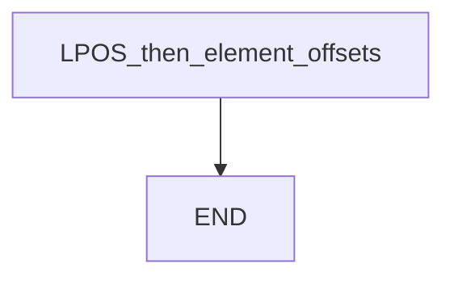

# PR from LPOS — guide

> Drill: `008-pr-lpos`  
> Code: [`code/solution.ls`](../code/solution.ls)

## Purpose

Capture **LPOS** into **PR[1]**, then add/subtract **placeholder** millimetres on Cartesian **elements** (study: 1=X, 2=Y — confirm on your software) and Linear to that PR. Distances are class examples, not a tray pitch.

## Flowchart

## Decisions (diamond)

No IF / WAIT / SKIP / UALM. Straight sequence.

## Block-by-block

| Lines | What | Atom |
|-------|------|------|
| 0–1 | LEGAL + element remark | Remark |
| 2–3 | Joint to work | J |
| 4 | `PR[1]=LPOS` | PR / LPOS |
| 5–12 | ±X / ±Y on `PR[1,e]` then Linear to PR | PR + L |
| 13 | Joint return | J |
| 14 | END | END |

## Safety

Prove in T1. Element index and millimetres must be taught on the cell. Site SOP and OEM manuals override this page.

## Rights

See [`LEGAL.md`](../../../../LEGAL.md): FANUC retains all rights. Educational use; own consent and risk.
