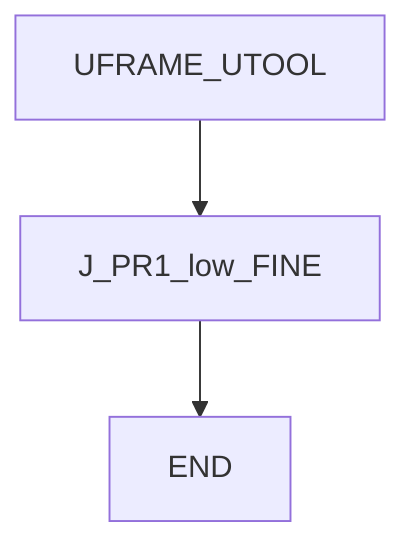
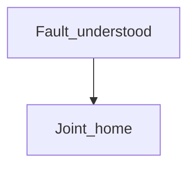

# Fault home — guide

> Drill: `009-fault-home`  
> Code: [`code/solution.ls`](../code/solution.ls)

## Purpose

After the **cause** of a fault is understood, Joint to taught **PR[1:Home]** at low percent, FINE. Study listing — ATTR sizes may be zero (not a backup).

## Flowchart

## Decisions (diamond)

No IF / WAIT / SKIP / UALM. Do not run this as a substitute for diagnosing the alarm.

## Block-by-block

| Lines | What | Atom |
|-------|------|------|
| 0–2 | LEGAL + ATTR + “after cause” remarks | Remark |
| 3–4 | Frame select | Frame |
| 5 | Joint home 10% FINE | J |
| 6 | END | END |

## Safety

Home must be free space. Reset does not fix the cause. Site SOP and OEM manuals override this page.

## Rights

See [`LEGAL.md`](../../../../LEGAL.md): FANUC retains all rights. Educational use; own consent and risk.
