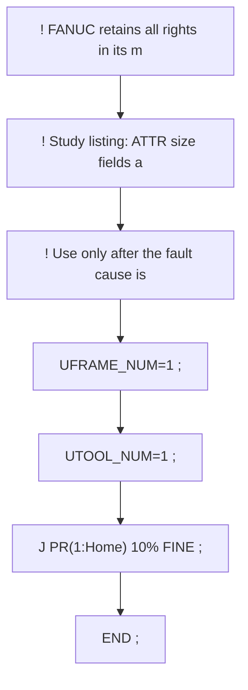
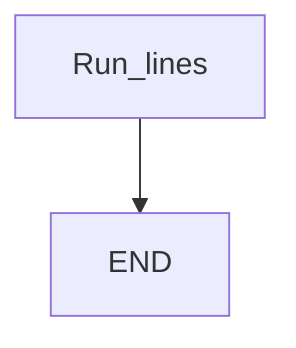

# Fault Home: recover to taught home — guide

> Drill: `009-fault-home`  
> Code: [`code/solution.ls`](../code/solution.ls)

## Purpose

Study listing for **Fault Home: recover to taught home**. Confirm frames, poses, and I/O on your cell.

## Flowchart

## Decisions (diamond)

No IF / WAIT / SKIP / UALM branch. Straight sequence.

## Block-by-block

| Line | What | Atom |
|------|------|------|
| 0 | `! FANUC retains all rights in its marks/software/manuals. Educational only. Use ` | Remark |
| 1 | `! Study listing: ATTR size fields are not a backup. Teach PR[1:Home] on the cell` | Remark |
| 2 | `! Use only after the fault cause is understood. Joint, low percent, FINE. ;` | Remark |
| 3 | `UFRAME_NUM=1 ;` | Frame |
| 4 | `UTOOL_NUM=1 ;` | Frame |
| 5 | `J PR[1:Home] 10% FINE    ;` | J |
| 6 | `END ;` | END |

## Safety

Prove in T1, then T2 step, then Auto. Placeholders only. Site SOP and OEM manuals override this page.

## Rights, education, and consent

FANUC retains **all rights** in its trademarks, software, and manuals. See [`LEGAL.md`](../../../../LEGAL.md).

This page and any linked programs are **educational and study-aid only**. Use at **your own consent and risk**. Garry TJ / this repo are not FANUC and offer no warranty.

