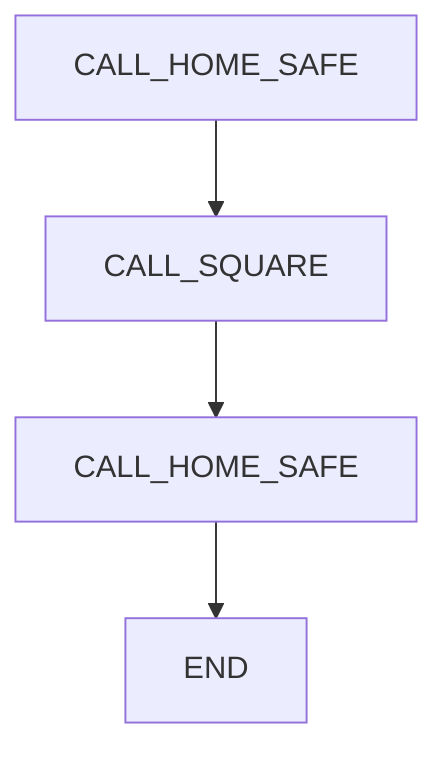
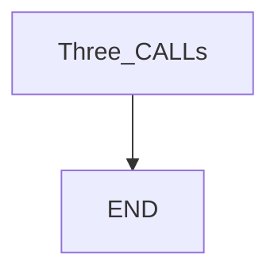

# Main CALL — guide

> Drill: `010-main-call`  
> Code: [`code/solution.ls`](../code/solution.ls)

## Purpose

A **main** that only **CALL**s: home, process, home. Callee names (`HOME_SAFE`, `SQUARE`) must exist on the **controller**, not only in this Git repo.

## Flowchart

## Decisions (diamond)

No IF / WAIT / SKIP / UALM. Straight CALL sequence.

## Block-by-block

| Lines | What | Atom |
|-------|------|------|
| 0–1 | LEGAL + names-must-exist remark | Remark |
| 2 | Home | CALL |
| 3 | Process (placeholder name) | CALL |
| 4 | Home | CALL |
| 5 | END | END |

## Safety

Prove each callee in T1 before chaining. Site SOP and OEM manuals override this page.

## Rights

See [`LEGAL.md`](../../../../LEGAL.md): FANUC retains all rights. Educational use; own consent and risk.
