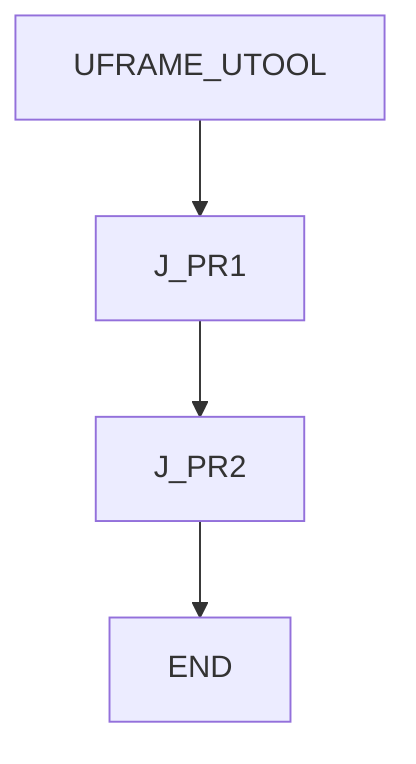
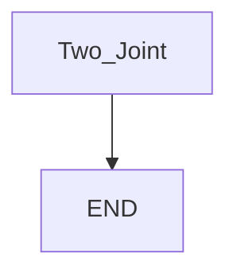

# Joint only — guide

> Drill: `011-joint-only`  
> Code: [`code/solution.ls`](../code/solution.ls)

## Purpose

**Atom:** two **J** moves, FINE, no Linear. Teach `PR[1]` and `PR[2]` on the cell. Feed is percent.

## Flowchart

## Decisions (diamond)

No IF / WAIT / SKIP / UALM.

## Block-by-block

| Lines | What | Atom |
|-------|------|------|
| 0–1 | LEGAL + teach-PR remark | Remark |
| 2–3 | Frame select | Frame |
| 4–5 | Joint PR[1] then PR[2], 15% FINE | J |
| 6 | END | END |

## Safety

Prove in T1 in free space. Site SOP and OEM manuals override this page.

## Rights

See [`LEGAL.md`](../../../../LEGAL.md): FANUC retains all rights. Educational use; own consent and risk.
