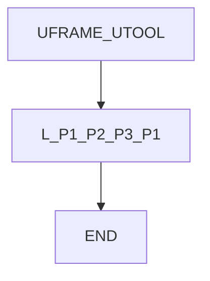
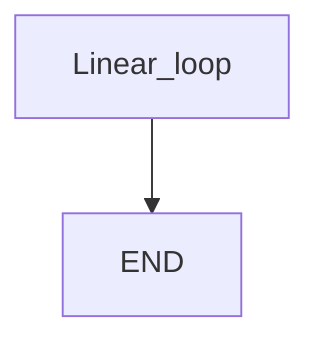

# Linear only — guide

> Drill: `012-linear-only`  
> Code: [`code/solution.ls`](../code/solution.ls)

## Purpose

**Atom:** **L** only (no Joint). Three points then back to P[1], FINE, mm/sec. Teach P[1]–P[3] on the cell.

## Flowchart

## Decisions (diamond)

No IF / WAIT / SKIP / UALM.

## Block-by-block

| Lines | What | Atom |
|-------|------|------|
| 0–1 | LEGAL + no-J remark | Remark |
| 2–3 | Frame select | Frame |
| 4–7 | Linear P[1]–P[3]–P[1] | L |
| 8 | END | END |

## Safety

Wrong UFRAME puts the straight line through the fixture. Prove in T1. Site SOP and OEM manuals override this page.

## Rights

See [`LEGAL.md`](../../../../LEGAL.md): FANUC retains all rights. Educational use; own consent and risk.
