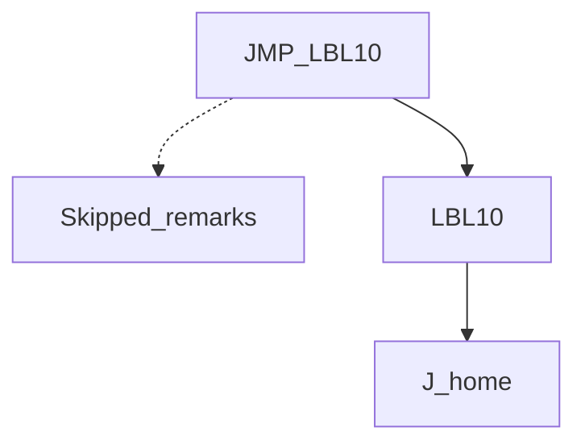
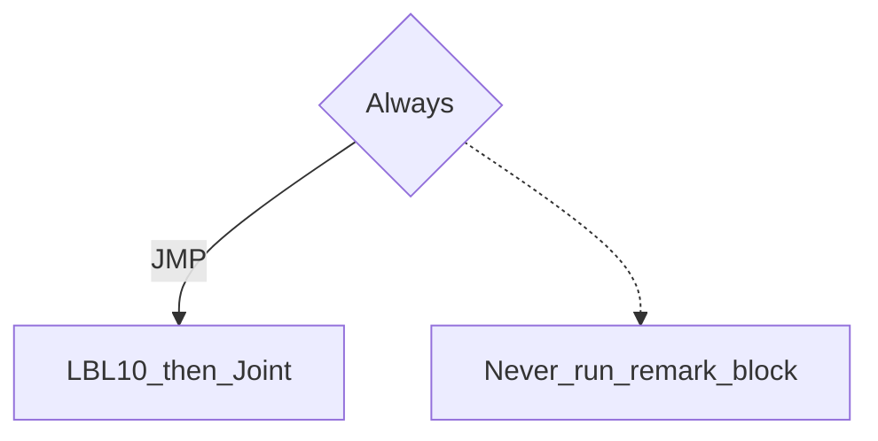

# LBL / JMP — guide

> Drill: `013-lbl-jmp`  
> Code: [`code/solution.ls`](../code/solution.ls)

## Purpose

**JMP LBL** skips a block of remarks, then Joint home. There is **no GOTO** on HandlingTool.

## Flowchart

## Decisions (diamond)

Unconditional JMP (always skip the remarks).

## Block-by-block

| Line | What | Atom |
|------|------|------|
| 0–1 | LEGAL + “not GOTO” | Remark |
| 2–3 | Frames | Frame |
| 4 | JMP LBL[10] | JMP |
| 5–6 | Remarks that do not run | Remark |
| 7 | Landing label | LBL |
| 8 | Joint home | J |
| 9 | END | END |

## Safety

Prove in T1. Site SOP and OEM manuals override this page.

## Rights

See [`LEGAL.md`](../../../../LEGAL.md): FANUC retains all rights. Educational use; own consent and risk.
