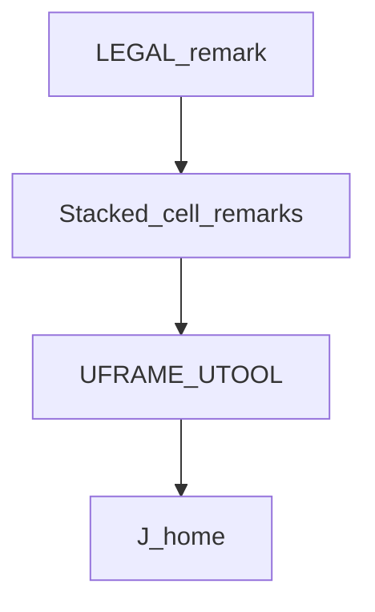
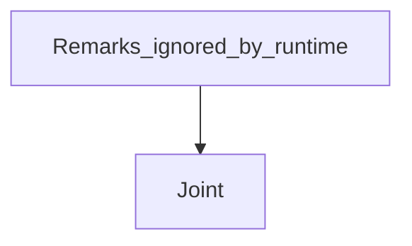

# Remark header — guide

> Drill: `014-remark-header`  
> Code: [`code/solution.ls`](../code/solution.ls)

## Purpose

Shows **single-line remarks** (`!` one instruction) and **stacked remarks** (several `!` lines in a row). HandlingTool has **no** `/* */` block comment. ATTR `COMMENT` is the program header string, not these lines. Then one Joint.

## Flowchart

## Decisions (diamond)

No branch. Remarks do not execute.

## Block-by-block

| Line | What | Atom |
|------|------|------|
| 0 | One LEGAL remark (single line) | Remark |
| 1–4 | Stacked remarks (multi-line notes) | Remark |
| 5–6 | Frames actually set | Frame |
| 7 | Joint home | J |
| 8 | END | END |

## Safety

Prove in T1. Site SOP and OEM manuals override this page.

## Rights, education, and consent

FANUC retains **all rights** in its trademarks, software, and manuals. See [`LEGAL.md`](../../../../LEGAL.md).

This page and any linked programs are **educational and study-aid only**. Use at **your own consent and risk**. Garry TJ / this repo are not FANUC and offer no warranty.
