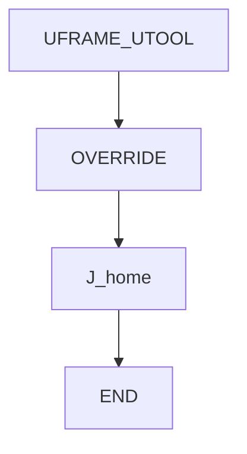
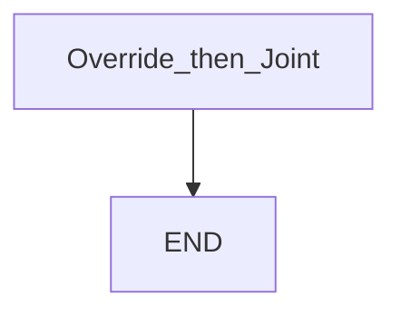

# OVERRIDE then Joint — guide

> Drill: `015-override-instr`  
> Code: [`code/solution.ls`](../code/solution.ls)

## Purpose

**Atom:** programmed **OVERRIDE** (placeholder 50%), then Joint home. Confirm the instruction name on your software. Not a safety device.

## Flowchart

## Decisions (diamond)

No IF / WAIT / SKIP / UALM.

## Block-by-block

| Lines | What | Atom |
|-------|------|------|
| 0–1 | LEGAL + not-safety remark | Remark |
| 2–3 | Frame select | Frame |
| 4 | `OVERRIDE=50%` | OVERRIDE |
| 5 | Joint home at programmed 100% (scaled by override) | J |
| 6 | END | END |

## Safety

Pendant override and this instruction both scale speed. Prove in T1. Site SOP and OEM manuals override this page.

## Rights

See [`LEGAL.md`](../../../../LEGAL.md): FANUC retains all rights. Educational use; own consent and risk.
