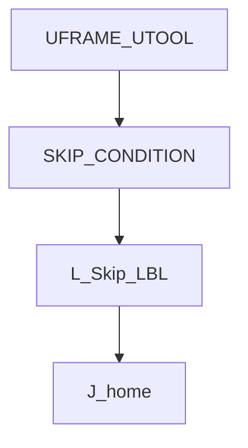
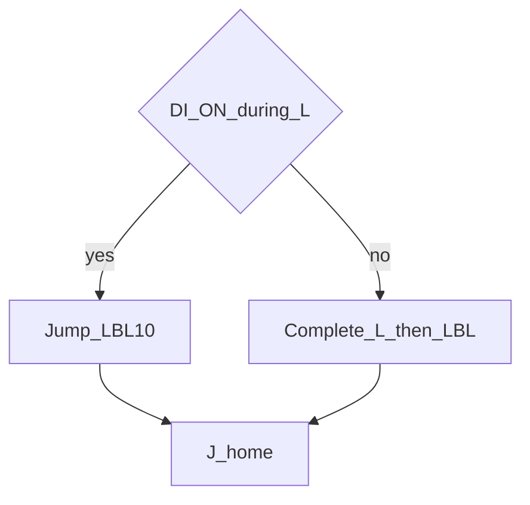

# SKIP on Linear — guide

> Drill: `016-skip-linear`  
> Code: [`code/solution.ls`](../code/solution.ls)

## Purpose

**Union:** arm **SKIP CONDITION** on a placeholder **DI**, Linear with **Skip,LBL**, then home. Not safety I/O. Confirm DI number on the cell.

## Flowchart

## Decisions (diamond)

Both paths meet at LBL[10] then Joint home.

## Block-by-block

| Lines | What | Atom |
|-------|------|------|
| 0–1 | LEGAL + placeholder DI remark | Remark |
| 2–3 | Frame select | Frame |
| 4 | Arm skip | SKIP CONDITION |
| 5 | Linear with Skip,LBL[10] | L + SKIP |
| 6–7 | Label and Joint home | LBL / J |
| 8 | END | END |

## Safety

SKIP is not an e-stop. DI[1] is a placeholder. Prove in T1. Site SOP and OEM manuals override this page.

## Rights

See [`LEGAL.md`](../../../../LEGAL.md): FANUC retains all rights. Educational use; own consent and risk.
