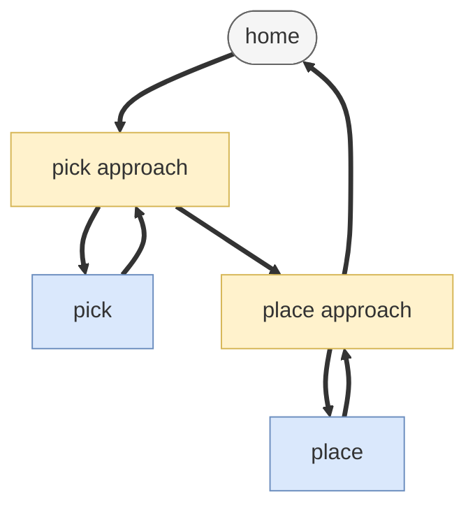

# Pick and place — guide

> Drill: `017-pick-place`  
> Code: [`code/solution.ls`](../code/solution.ls)

## Purpose

Do **not** start here. After 001, 007, and 011–012:

In plain English: go above the part, Linear down to pick, close gripper and wait, place, go home. If the gripper never confirms, alarm and abort.

On the pendant: approach **J**, pick **L**, **RO** / **WAIT RI**, place, home. Timeout **UALM ABORT**. RI/RO are placeholders.

## Path / origin

Study sketch in **UFRAME**. Not millimetres. Teach on the cell.

Home → pick approach → pick → place approach → place → home.



## Program flow

```mermaid
flowchart TB
  start(["start"])
  rem("L0-1 placeholders")
  fr["L2-3 UFRAME UTOOL"]
  pick["L4-5 J approach L pick"]
  ro[/"L6 RO1=ON"/]
  wait{"L7 WAIT RI TIMEOUT?"}
  place["L8-13 retreat place home"]
  ualm["L16 UALM1"]
  abort["L17 ABORT"]
  endn(["L19 END"])
  start -.-> rem
  rem --> fr
  fr ==> pick
  pick --> ro
  ro ==> wait
  wait -->|ON| place
  wait -.->|TIMEOUT LBL90| ualm
  ualm --> abort
  place ==> endn
  classDef proc fill:#DAE8FC,stroke:#6C8EBF
  classDef dec fill:#FFF2CC,stroke:#D6B656
  classDef io fill:#D5E8D4,stroke:#82B366
  classDef call fill:#E1D5E7,stroke:#9673A6
  classDef fault fill:#F8CECC,stroke:#B85450
  classDef term fill:#F5F5F5,stroke:#666666
  classDef note fill:#FFFFFF,stroke:#999999,stroke-dasharray: 5 5
  class start,endn term
  class rem note
  class fr,pick,place proc
  class ro io
  class wait dec
  class ualm,abort fault
```

## Listing (`/MN`)

`L#` on the chart is the number before `:` here. Full file: [`code/solution.ls`](../code/solution.ls). Step it yourself: the **Run** tab on this drill's page in the study UI (FWD like T2, toggle I/O, watch registers).

```
   0:  ! FANUC retains all rights in its marks/software/manuals. Educational only. Use at your own consent and risk. See LEGAL.md ;
   1:  ! Union: pick/place. RI/RO PLACEHOLDERS. ;
   2:  UFRAME_NUM=1 ;
   3:  UTOOL_NUM=1 ;
   4:  J P[1:PkAp] 20% FINE    ;
   5:  L P[2:Pick] 80mm/sec FINE    ;
   6:  RO[1]=ON ;
   7:  WAIT RI[1]=ON TIMEOUT,LBL[90] ;
   8:  L P[1:PkAp] 80mm/sec FINE    ;
   9:  J P[3:PlAp] 20% FINE    ;
  10:  L P[4:Place] 80mm/sec FINE    ;
  11:  RO[1]=OFF ;
  12:  L P[3:PlAp] 80mm/sec FINE    ;
  13:  J PR[1:Home] 20% FINE    ;
  14:  JMP LBL[99] ;
  15:  LBL[90] ;
  16:  UALM[1] ;
  17:  ABORT ;
  18:  LBL[99] ;
  19:  END ;
```

## Block-by-block

How to read this chart: [`how-to-read-a-guide.md`](../../../../docs/fanuc/how-to-read-a-guide.md). Atoms (J, L, WAIT, …): [`glossary.md`](../../../../docs/glossary.md).

| Lines | What | Atom |
|-------|------|------|
| 0–1 | LEGAL + placeholder I/O | [Remark](../../../../docs/fanuc/programming-tp/remark.md) |
| 2–3 | Frame select | [Frame](../../../../docs/fanuc/io-frames-tools/frames.md) |
| 4–5 | Approach and pick Linear | [J](../../../../docs/fanuc/programming-tp/motion-j.md) / [L](../../../../docs/fanuc/programming-tp/motion-l.md) |
| 6–7 | RO ON, WAIT RI | [I/O](../../../../docs/fanuc/io-frames-tools/io-classes.md) / [WAIT](../../../../docs/fanuc/io-frames-tools/io-classes.md) |
| 8–13 | Place and home | [J](../../../../docs/fanuc/programming-tp/motion-j.md) / [L](../../../../docs/fanuc/programming-tp/motion-l.md) / [I/O](../../../../docs/fanuc/io-frames-tools/io-classes.md) |
| 14–19 | Skip fault or UALM ABORT | [JMP](../../../../docs/fanuc/programming-tp/logic-lbl-jmp.md) / [UALM](../../../../docs/fanuc/programming-tp/ualm.md) |

## Safety

Prove in T1, then T2 step, then Auto. Placeholders only. Site SOP and OEM manuals override this page.

## Rights

See [`LEGAL.md`](../../../../LEGAL.md): FANUC retains all rights. Educational use; own consent and risk.
