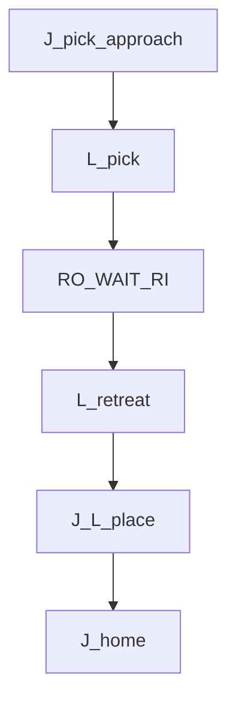
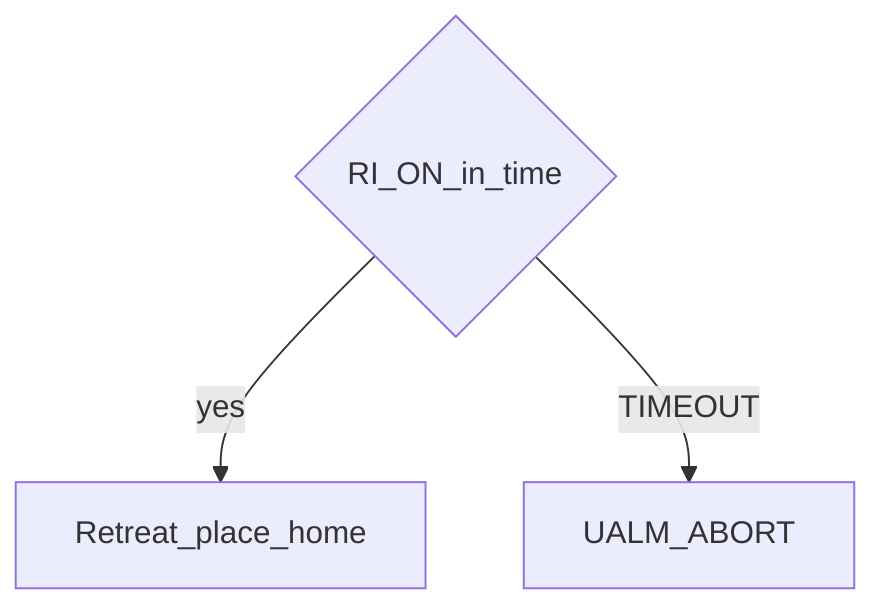

# Pick and place — guide

> Drill: `017-pick-place`  
> Code: [`code/solution.ls`](../code/solution.ls)

## Purpose

Union of Joint approach, Linear pick/place, gripper **RO/WAIT RI**, retreat, home. Timeout fires **UALM** and **ABORT**.

## Flowchart

## Decisions (diamond)

## Block-by-block

| Line | What | Atom |
|------|------|------|
| 0–3 | LEGAL, placeholders, frames | Remark / Frame |
| 4–5 | Approach J, pick L | J / L |
| 6–7 | Gripper ON, WAIT RI | I/O / WAIT |
| 8–13 | Retreat, place, home | L / J |
| 14 | Skip fault | JMP |
| 15–17 | UALM, ABORT | UALM |
| 18–19 | Success END | LBL |

## Safety

FINE at pick and place. I/O placeholders. Prove in T1.

## Rights, education, and consent

FANUC retains **all rights** in its trademarks, software, and manuals. See [`LEGAL.md`](../../../../LEGAL.md).

This page and any linked programs are **educational and study-aid only**. Use at **your own consent and risk**. Garry TJ / this repo are not FANUC and offer no warranty.
