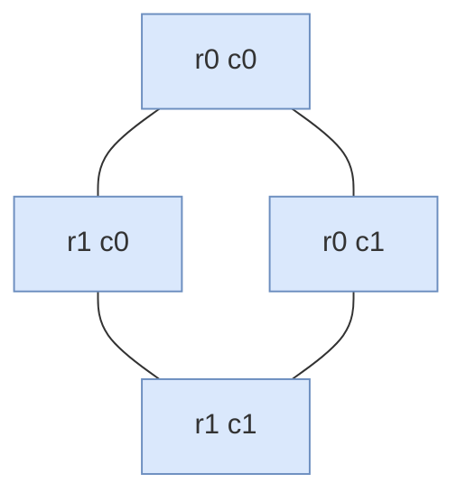

# Pallet grid — guide

> Drill: `018-pallet-grid`  
> Code: [`code/solution.ls`](../code/solution.ls)

## Purpose

Do **not** start here. After 001, 006, and [pallet math](../../../../docs/fanuc/applications/pallet-grid.md).

In plain English: visit a **grid of slots** (rows and columns), shifting each visit by a taught pitch, then Joint home.

On the pendant: **R[]** row/col, **X = X0 + col×dx**, **Y = Y0 + row×dy** into a **PR**, **OFFSET CONDITION**, **L Offset**. Pitch is taught on the cell.

## Path / origin

Study sketch in **UFRAME**. Not millimetres. Teach on the cell.

Grid of the **same nest**, shifted by row/col. Not twenty copied P[].



## Program flow

```mermaid
flowchart TB
  start(["start"])
  rem("L0-1 matrix remark")
  init["L2-12 frames and R pitch"]
  lbl["L13 LBL10"]
  math["L14-19 XY to PR OFFSET L"]
  col{"L21 col less nCols?"}
  row{"L24 row less nRows?"}
  home["L25 J home"]
  endn(["L26 END"])
  start -.-> rem
  rem --> init
  init ==> lbl
  lbl ==> math
  math ==> col
  col -->|yes JMP LBL10| lbl
  col -->|no| row
  row -->|yes JMP LBL10| lbl
  row -.->|no| home
  home ==> endn
  classDef proc fill:#DAE8FC,stroke:#6C8EBF
  classDef dec fill:#FFF2CC,stroke:#D6B656
  classDef io fill:#D5E8D4,stroke:#82B366
  classDef call fill:#E1D5E7,stroke:#9673A6
  classDef fault fill:#F8CECC,stroke:#B85450
  classDef term fill:#F5F5F5,stroke:#666666
  classDef note fill:#FFFFFF,stroke:#999999,stroke-dasharray: 5 5
  class start,endn term
  class rem note
  class init,lbl,math,home proc
  class col,row dec
```

## Listing (`/MN`)

`L#` on the chart is the number before `:` here. Full file: [`code/solution.ls`](../code/solution.ls).

```
   0:  ! FANUC retains all rights in its marks/software/manuals. Educational only. Use at your own consent and risk. See LEGAL.md ;
   1:  ! Matrix: X=X0+col*dx, Y=Y0+row*dy. Teach X0 Y0 dx dy on cell. PR element 1=X 2=Y confirm. ;
   2:  UFRAME_NUM=1 ;
   3:  UTOOL_NUM=1 ;
   4:  R[1]=0 ;
   5:  R[2]=0 ;
   6:  R[3]=2 ;
   7:  R[4]=2 ;
   8:  ! R[5]=dx R[6]=dy R[10]=X0 R[11]=Y0 PLACEHOLDERS. Load real mm on cell. ;
   9:  R[5]=50 ;
  10:  R[6]=50 ;
  11:  R[10]=0 ;
  12:  R[11]=0 ;
  13:  LBL[10] ;
  14:  R[7]=R[10]+R[2]*R[5] ;
  15:  R[8]=R[11]+R[1]*R[6] ;
  16:  PR[2,1]=R[7] ;
  17:  PR[2,2]=R[8] ;
  18:  OFFSET CONDITION PR[2] ;
  19:  L P[2] 100mm/sec FINE Offset ;
  20:  R[2]=R[2]+1 ;
  21:  IF R[2]<R[4],JMP LBL[10] ;
  22:  R[2]=0 ;
  23:  R[1]=R[1]+1 ;
  24:  IF R[1]<R[3],JMP LBL[10] ;
  25:  J PR[1:Home] 20% FINE    ;
  26:  END ;
```

## Block-by-block

How to read this chart: [`how-to-read-a-guide.md`](../../../../docs/fanuc/how-to-read-a-guide.md). Atoms (J, L, WAIT, …): [`glossary.md`](../../../../docs/glossary.md).

| Lines | What | Atom |
|-------|------|------|
| Init L2–12 | R row/col limits, placeholder dx dy X0 Y0 | [R[]](../../../../docs/fanuc/programming-tp/registers-numeric.md) |
| L13–19 | Compute PR XY, OFFSET CONDITION, Linear Offset | [OFFSET](../../../../docs/fanuc/programming-tp/offset-and-incremental.md) / [PR](../../../../docs/fanuc/io-frames-tools/pr-vs-r.md) |
| L20–24 | IF col/row JMP LBL[10] | [JMP](../../../../docs/fanuc/programming-tp/logic-lbl-jmp.md) / [IF](../../../../docs/fanuc/programming-tp/logic-lbl-jmp.md) |
| L25–26 | Joint home, END | [J](../../../../docs/fanuc/programming-tp/motion-j.md) |

## Safety

Prove in T1, then T2 step, then Auto. Placeholders only. Site SOP and OEM manuals override this page.

## Rights

See [`LEGAL.md`](../../../../LEGAL.md): FANUC retains all rights. Educational use; own consent and risk.
