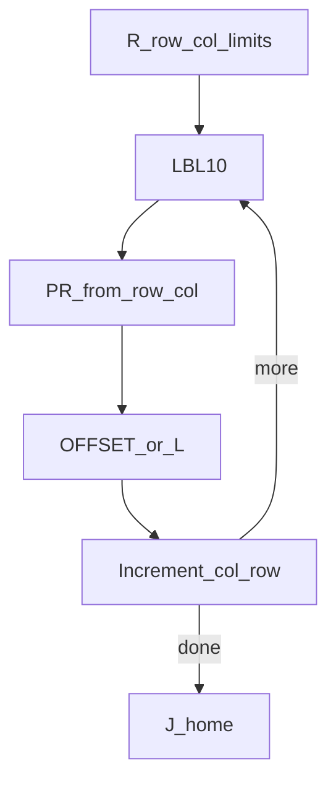
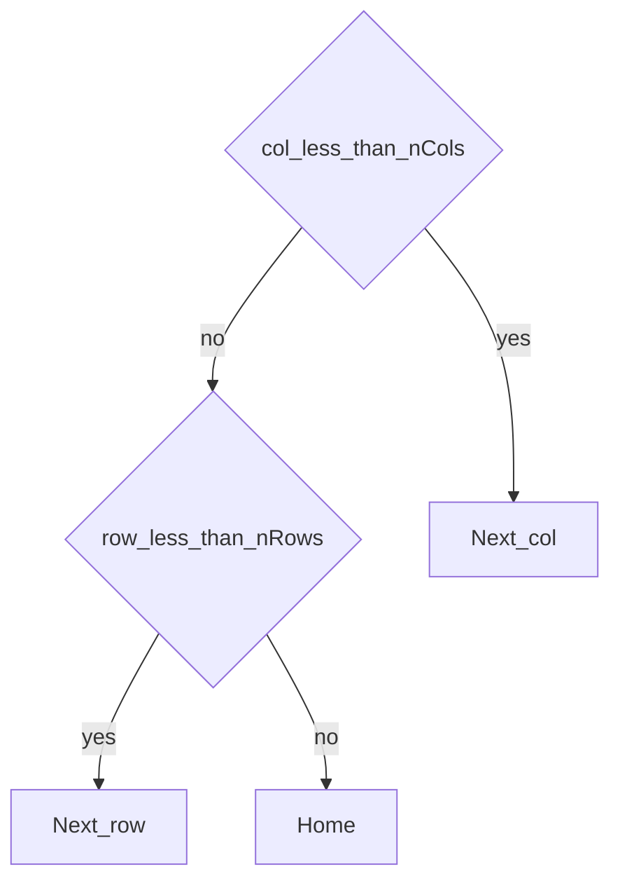

# Pallet grid — guide

> Drill: `018-pallet-grid`  
> Code: [`code/solution.ls`](../code/solution.ls)

## Purpose

Nested **row/col** using **R[]**. Displacement is a **matrix**: `X = X0 + col*dx`, `Y = Y0 + row*dy`. Pitch `dx, dy` and origin live in a PR you **teach** (placeholders in the listing). Optional layer: `Z = Z0 + layer*dz`. Linear index: `index = row * nCols + col`.

## Flowchart

## Decisions (diamond)

## Block-by-block

| Line | What | Atom |
|------|------|------|
| Init | R[1] row, R[2] col, R[3] nRows, R[4] nCols, R[5]/R[6] placeholder dx/dy | R[] |
| Loop | Apply X/Y into PR then OFFSET or Linear Offset | OFFSET / PR |
| IF | JMP while col/row remain | JMP/IF |
| End | Joint home | J |

See article [`docs/fanuc/applications/pallet-grid.md`](../../../../docs/fanuc/applications/pallet-grid.md).

## Safety

First cell at low T1 override. Do not copy millimetres from this repo. Site SOP and OEM manuals override this page.

## Rights

See [`LEGAL.md`](../../../../LEGAL.md): FANUC retains all rights. Educational use; own consent and risk.
