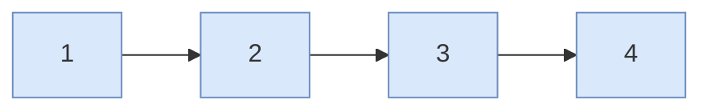

# Contour polyline — guide

> Drill: `019-contour-plot`  
> Code: [`code/solution.ls`](../code/solution.ls)

## Purpose

Do **not** start here as a first drill. After 012:

In plain English: Joint to the start, then several Linear points as a **polyline** (not Circular arcs), then Joint home.

On the pendant: **J**, several **L**, **J** home.

## Path / origin

Study sketch in **UFRAME**. Not millimetres. Teach on the cell.

Polyline **1-2-3-4**, not Circular via/dest.



## Program flow

```mermaid
flowchart TB
  start(["start"])
  rem("L0-1 not Circular")
  fr["L2-3 UFRAME UTOOL"]
  js["L4 J P1"]
  poly["L5-8 L polyline"]
  jh["L9 J home"]
  endn(["L10 END"])
  start -.-> rem
  rem --> fr
  fr ==> js
  js ==> poly
  poly ==> jh
  jh ==> endn
  classDef proc fill:#DAE8FC,stroke:#6C8EBF
  classDef dec fill:#FFF2CC,stroke:#D6B656
  classDef io fill:#D5E8D4,stroke:#82B366
  classDef call fill:#E1D5E7,stroke:#9673A6
  classDef fault fill:#F8CECC,stroke:#B85450
  classDef term fill:#F5F5F5,stroke:#666666
  classDef note fill:#FFFFFF,stroke:#999999,stroke-dasharray: 5 5
  class start,endn term
  class rem note
  class fr,js,poly,jh proc
```

## Listing (`/MN`)

`L#` on the chart is the number before `:` here. Full file: [`code/solution.ls`](../code/solution.ls). Step it yourself: the **Run** tab on this drill's page in the study UI (FWD like T2, toggle I/O, watch registers).

```
   0:  ! FANUC retains all rights in its marks/software/manuals. Educational only. Use at your own consent and risk. See LEGAL.md ;
   1:  ! Union: contour/plot polyline. Not Circular. ;
   2:  UFRAME_NUM=1 ;
   3:  UTOOL_NUM=1 ;
   4:  J P[1] 20% FINE    ;
   5:  L P[2] 120mm/sec FINE    ;
   6:  L P[3] 120mm/sec FINE    ;
   7:  L P[4] 120mm/sec FINE    ;
   8:  L P[5] 120mm/sec FINE    ;
   9:  J PR[1:Home] 20% FINE    ;
  10:  END ;
```

## Block-by-block

How to read this chart: [`how-to-read-a-guide.md`](../../../../docs/fanuc/how-to-read-a-guide.md). Atoms (J, L, WAIT, …): [`glossary.md`](../../../../docs/glossary.md).

| Lines | What | Atom |
|-------|------|------|
| 0–1 | LEGAL + not-Circular remark | [Remark](../../../../docs/fanuc/programming-tp/remark.md) |
| 2–3 | Frame select | [Frame](../../../../docs/fanuc/io-frames-tools/frames.md) |
| 4 | Joint to first point | [J](../../../../docs/fanuc/programming-tp/motion-j.md) |
| 5–8 | Linear polyline | [L](../../../../docs/fanuc/programming-tp/motion-l.md) |
| 9 | Joint home | [J](../../../../docs/fanuc/programming-tp/motion-j.md) |
| 10 | END | [END](../../../../docs/glossary.md) |

## Safety

Prove in T1, then T2 step, then Auto. Placeholders only. Site SOP and OEM manuals override this page.

## Rights

See [`LEGAL.md`](../../../../LEGAL.md): FANUC retains all rights. Educational use; own consent and risk.
