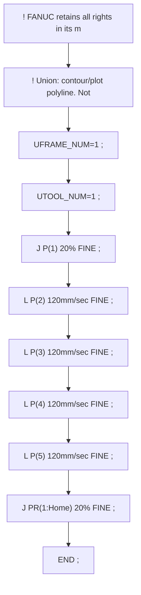
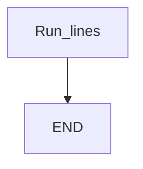

# Contour plot: polyline of Linear points — guide

> Drill: `019-contour-plot`  
> Code: [`code/solution.ls`](../code/solution.ls)

## Purpose

Study listing for **Contour plot: polyline of Linear points**. Confirm frames, poses, and I/O on your cell.

## Flowchart

## Decisions (diamond)

No IF / WAIT / SKIP / UALM branch. Straight sequence.

## Block-by-block

| Line | What | Atom |
|------|------|------|
| 0 | `! FANUC retains all rights in its marks/software/manuals. Educational only. Use ` | Remark |
| 1 | `! Union: contour/plot polyline. Not Circular. ;` | Remark |
| 2 | `UFRAME_NUM=1 ;` | Frame |
| 3 | `UTOOL_NUM=1 ;` | Frame |
| 4 | `J P[1] 20% FINE    ;` | J |
| 5 | `L P[2] 120mm/sec FINE    ;` | L |
| 6 | `L P[3] 120mm/sec FINE    ;` | L |
| 7 | `L P[4] 120mm/sec FINE    ;` | L |
| 8 | `L P[5] 120mm/sec FINE    ;` | L |
| 9 | `J PR[1:Home] 20% FINE    ;` | J |
| 10 | `END ;` | END |

## Safety

Prove in T1, then T2 step, then Auto. Placeholders only. Site SOP and OEM manuals override this page.

## Rights, education, and consent

FANUC retains **all rights** in its trademarks, software, and manuals. See [`LEGAL.md`](../../../../LEGAL.md).

This page and any linked programs are **educational and study-aid only**. Use at **your own consent and risk**. Garry TJ / this repo are not FANUC and offer no warranty.

