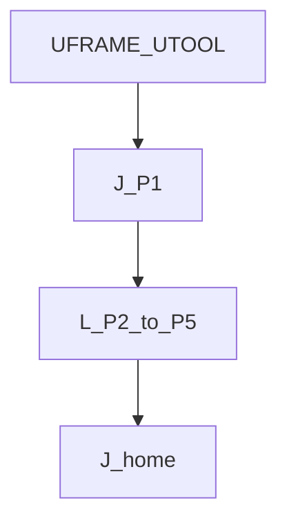
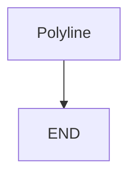

# Contour / plot polyline — guide

> Drill: `019-contour-plot`  
> Code: [`code/solution.ls`](../code/solution.ls)

## Purpose

**Union:** Joint to start, several **L** points as a polyline (not Circular), Joint home. Teach P[1]–P[5] and home on the cell.

## Flowchart

## Decisions (diamond)

No IF / WAIT / SKIP / UALM.

## Block-by-block

| Lines | What | Atom |
|-------|------|------|
| 0–1 | LEGAL + not-Circular remark | Remark |
| 2–3 | Frame select | Frame |
| 4 | Joint to first point | J |
| 5–8 | Linear polyline | L |
| 9 | Joint home | J |
| 10 | END | END |

## Safety

FINE on first teach. CNT is a later variant. Site SOP and OEM manuals override this page.

## Rights

See [`LEGAL.md`](../../../../LEGAL.md): FANUC retains all rights. Educational use; own consent and risk.
