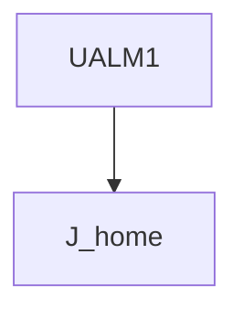
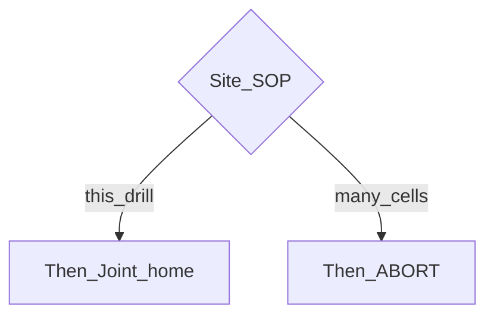

# User Alarm — guide

> Drill: `020-user-alarm`  
> Code: [`code/solution.ls`](../code/solution.ls)

## Purpose

Atom: raise **UALM[1]**, then Joint home. Alarm **text** is on the controller. MESSAGE (021) does not replace this.

## Flowchart

## Decisions (diamond)

No IF. UALM is the event; some sites ABORT instead of moving home — follow SOP.

## Block-by-block

| Line | What | Atom |
|------|------|------|
| 0–1 | LEGAL + configure alarm text | Remark |
| 2–3 | Frames | Frame |
| 4 | User alarm | UALM |
| 5 | Joint home | J |
| 6 | END | END |

## Safety

Prove in T1. Site SOP and OEM manuals override this page.

## Rights, education, and consent

FANUC retains **all rights** in its trademarks, software, and manuals. See [`LEGAL.md`](../../../../LEGAL.md).

This page and any linked programs are **educational and study-aid only**. Use at **your own consent and risk**. Garry TJ / this repo are not FANUC and offer no warranty.
