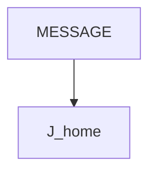
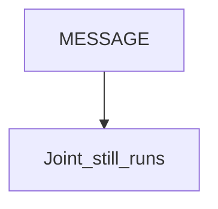

# MESSAGE — guide

> Drill: `021-message`  
> Code: [`code/solution.ls`](../code/solution.ls)

## Purpose

Show a **MESSAGE** then Joint. Runtime **does not halt** for the message the way **UALM** does. Confirm the instruction name on your pendant.

## Flowchart

## Decisions (diamond)

No fault branch. Motion still runs.

## Block-by-block

| Line | What | Atom |
|------|------|------|
| 0–1 | LEGAL + confirm menu name | Remark |
| 2–3 | Frames | Frame |
| 4 | MESSAGE[1] placeholder | MESSAGE |
| 5 | Joint home | J |
| 6 | END | END |

## Safety

MESSAGE is not a safety function. Prove in T1.

## Rights

See [`LEGAL.md`](../../../../LEGAL.md): FANUC retains all rights. Educational use; own consent and risk.
